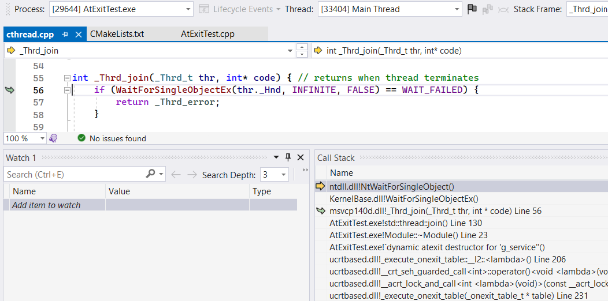
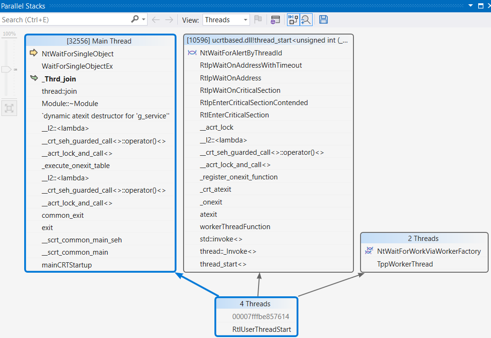

# How I stepped into an issue

> Well, we all know that Singletons are hard to get right, but a small static variable can't hurt all that much. It certainly works for me!
<cite> — a library developer by the end of the day</cite>

A little quiz: how long does it take for the following code to terminate?


#include <thread>

volatile int g_sideEffect = 0;
struct Something
{
    Something()             { g_sideEffect++; }
    ~Something()            { g_sideEffect++; }
};

class Module
{
	std::thread m_workerThread;
	static void workerThreadFunction()
	{
		std::this_thread::sleep_for(std::chrono::seconds(1));

		static Something s;
	}

public:
    
    Module()
    {
		m_workerThread = std::thread(&Module::workerThreadFunction);
    }

    ~Module()
    {
        if (m_workerThread.joinable())
            m_workerThread.join();
    }
};

Module g_service;

int main()
{
    return 0;
}


A hint under the spoiler.

If compiled with glibc/stdlib++, it typically takes around 1 second. However, on Windows with MSVC, as of today, it depends on the developer's patience and power supply due to a deadlock.  

Despite appearing artificial, such a use case occurred on a typical MFC application that joins an HTTP listener thread upon exit in the destructor of a module with static storage duration. Usually, it works, but a deadlock occurs if the last-moment HTTP request is received. 

Long story short: a platform-dependent code gathers additional information when the connection is interrupted. It looked like a good idea to encapsulate platform-dependent error handing in a lazily-initialized singleton, so the resulting code mirrors the example code above.

# A bit of debugging

Let’s dive into the example in the Visual Studio debugger. Hit the pause button and load the symbols as necessary: we observe the main thread joining the worker during the destruction of the static module.

At first glance, it looks like a worker thread bug (you know, real-world thread functions are a bit more contrived than the given example), so let’s find and examine it.

While the `std::thread` conveniently provides us a thread ID within its object internals, the RAW Win32 threads API won’t, so we might see the `WaitForSingleObjectEx` waiting on some handle with no idea about the thread ID.

## Searching for the deadlock counterpart thread

A hardworking developer could examine all the application threads call-stacks one by one, but as our serious application has a lot of threads, including some auxiliary ones, we'll try to speed up the investigation process.

There are few options that came to my mind:
* get the thread ID from the handle;
* stare at the Parallel Stacks in the VS debugger until enlightened.

## Getting a thread ID from its handle

Let's imagine that there is no <code>std::thread&#58;:_Id</code> member variable. Only a RAW Win32 thread handle, `0x0000009C`, for example. 

A handle is a process-local descriptor of the opened resource, similar to the index in the opened resources table. Although the handle value hides any information about the resource it points to, we can query details using undocumented API or leverage the [Handle tool](https://learn.microsoft.com/en-us/sysinternals/downloads/handle/) from the Sysinternals Utilities by Mark Russinovich that serves the same purpose.

The Handle utility will enumerate all running processes in the system and dump each opened handle alongside details of what this handle points to. Then, we could match our handle value with dumped information to find a thread ID and switch to it in the debugger. 

Looking at the manual, let's craft a command line: `-a` for _all_, `-v` for _CSV_:
c:\tools\handles>handle -a -v > handles.csv


Hit <kbd>ENTER</kbd>, wait until your patience runs out, realizing that Handle.exe is trying to inject its code into a frozen process to gather details. To let the tool execute the code inside the debugged process, hit 'Continue' in the debugger. Then a CSV with all the opened handles appears. Quite a lot, but we have a grep or a table processor to search for our handle by value. 

Now we know that the main thread is waiting for the termination of the thread with ID 10596, so we can select it in the VS thread dropdown among many others and investigate its call stack to find out what it waits for. We'll do this after describing the alternate solution.

## VS debugger: Parallel Stacks

However, a handle insight may be unavailable. For example, when investigating a minidump taken a long time ago far away from the developer’s PC.

In this case, a Parallel Stack feature of VS debugger may group call stacks of all threads to give an insight into the overall state.

By carefully examining all of the application's threads, we can identify two threads waiting in suspicious locations: 
* the main one has acquired a mutex through the `__acrt_lock_and_call` and is currently waiting for another thread termination inside `std::exit -> ... -> _execute_onexit_table -> ... -> ~Module() -> join()`;
* thread 10596 is waiting to acquire a critical section lock inside `std::atexit -> ... -> _register_onexit_function -> __acrt_lock_and_call`. 

We might be close to the solution.

# The origin of the `std::exit` and `std::atexit` calls 

The compiler generates a `std::exit` call to perform a normal C++ program termination when the `main()` has completed execution: its responsibility is the necessary cleanup, including the destruction of variables with static storage duration. 

Regarding `std::atexit`, its purpose here is registering static object destructors invocation in the <abbr title="Last In - First Out">LIFO</abbr> order because the order may be runtime-defined and unknown at the compile-time: 

int foo()
{
    static SomethingA a; // initialized once the 'foo' is called
}

int bar()
{
    static SomethingB b; // initialized once the 'bar' is called
}

int main()
{
    // foo::a and bar::b initialization order is determined by run-time, happy QA-ing!
    if (0 != (time(nullptr) % 2))
        foo();

    bar();
    foo();
}


Thus the constructor of an object with a static lifetime registers its destructor at runtime. I didn't find the requirement for the compiler to use `std::atexit` for it, but this assumption looks reasonable given the `std::exit` documentation:

> Causes normal program termination to occur.                                                                             
> Several cleanup steps are performed:  
> 1)The destructors of objects with thread local storage duration that are associated with the current thread, the destructors of objects with static storage duration, and the functions registered with <code>std::atexit</code> are executed concurrently, while maintaining the following guarantees: 
> a) The last destructor for thread-local objects is sequenced-before the first destructor for a static object 
> b) If the completion of the constructor or dynamic initialization for thread-local or static object A was sequenced-before thread-local or static object B, the completion of the destruction of B is sequenced-before the start of the destruction of A 
> c) If the completion of the initialization of a static object A was sequenced-before the call to <code>std::atexit</code> for some function F, the call to F during termination is sequenced-before the start of the destruction of A 
> d) If the call to <code>std::atexit</code> for some function F was sequenced-before the completion of initialization of a static object A, the start of the destruction of A is sequenced-before the call to F during termination. 
> e) If a call to <code>std::atexit</code> for some function F1 was sequenced-before the call to <code>std::atexit</code> for some function F2, then the call to F2 during termination is sequenced-before the call to F1  
> ...
<cite> -- [cppreference on std::exit](https://en.cppreference.com/w/cpp/utility/program/exit)</cite>

In essence, a constructor of the static variable will call `std::atexit` or its internal counterpart to register the destructor, if the destructor is non-trivial. Later, `std::exit` will call registered destructors alongside other deinitialization callbacks using a <abbr title="Last In - First Out">LIFO</abbr> order.

## A glance at various `std::exit` implementations

Since the `std::atexit` [is thread-safe](https://en.cppreference.com/w/cpp/utility/program/atexit), it's synchronized with `std::exit` to avoid race conditions. However, the synchronization may incur a thread lock, which may introduce a possibility of a deadlock.

Now, let’s explore different implementations to get an insight into the underlying mechanisms and potential issues involved.

### Win32: Universal CRT

Starting from the Windows 10, the C Runtime is a separate system component. Its source code is a part of Windows SDK, so let's navigate to `C:\Program Files (x86)\Windows Kits\10\Source\[SDK-version]\ucrt\startup\onexit.cpp` and dive into the `_execute_onexit_table` and `_register_onexit_function` functions. As we already know from callstacks, they are responsible for `std::exit` and `std::atexit` callbacks processing:


// This function executes a table of _onexit()/atexit() functions.  The
// terminators are executed in reverse order, to give the required LIFO
// execution order.  If the table is uninitialized, this function has no
// effect.  After executing the terminators, this function resets the table
// so that it is uninitialized.  Returns 0 on success; -1 on failure.
extern "C" int __cdecl _execute_onexit_table(_onexit_table_t* const table)
{
    return __acrt_lock_and_call(__acrt_select_exit_lock(), [&]
    {
        // ... 
        // This loop calls through caller-provided function pointers.
        // ...
        {
            // ... 
            for (;;)
            {
                // Find the last valid function pointer to call:
                while (--last >= first && *last == encoded_nullptr)
                {
                    // Keep going backwards
                }

                if (last < first)
                {
                    // There are no more valid entries in the list; we are done:
                    break;
                }

                // Store the function pointer and mark it as visited in the list:
                _PVFV const function = __crt_fast_decode_pointer(*last);
                *last = encoded_nullptr;

                function();

                _PVFV* const new_first = __crt_fast_decode_pointer(table->_first);
                _PVFV* const new_last  = __crt_fast_decode_pointer(table->_last);

                // Reset iteration if either the begin or end pointer has changed:
                if (new_first != saved_first || new_last != saved_last)
                {
                    first = saved_first = new_first;
                    last  = saved_last  = new_last;
                }
            }
        }
        // ...
    });
}

// Appends the given 'function' to the given onexit 'table'.  Returns 0 on
// success; returns -1 on failure.  In general, failures are considered fatal
// in calling code.
extern "C" int __cdecl _register_onexit_function(_onexit_table_t* const table, _onexit_t const function)
{
    return __acrt_lock_and_call(__acrt_select_exit_lock(), [&]
    {
        // ...
    }
}

Both functions are technically lambdas guarded by the same Critical Section and a 'try..except' SEH guard. A summary of `_execute_onexit_table`:
1. Iterate over a linked list of handlers searching for the topmost non-null callback `function()` using the <abbr title="Last In - First Out">LIFO</abbr> rule.
2. Mark the topmost non-null callback as executed by setting it to nullptr and calling it.
3. If the callback added a new hander during the execution, reset the iteration from the top of the list.
4. Loop until there are pending callbacks in the list.

A kind of recursion on step 3 works fine because Critical Section works like a _recursive_ mutex, thus `std::atexit -> _register_onexit_function` will not be blocked when called from the callback handler of the same thread. 

However, a deadlock will occur if `function()` is waining on another thread while that thread tries to lock the same Critical Section to add another `atexit` handler. 

### GNU C Library 

Another widespread C library is a glibc. Let's look at its `/stdlib/exit.c: __run_exit_handlers()` [source code](https://github.com/bminor/glibc/blob/4290aed05135ae4c0272006442d147f2155e70d7/stdlib/exit.c#L98):

/* Call all functions registered with `atexit' and `on_exit',
   in the reverse of the order in which they were registered
   perform stdio cleanup, and terminate program execution with STATUS.  */
void
attribute_hidden
__run_exit_handlers (int status, struct exit_function_list **listp,
             bool run_list_atexit, bool run_dtors)
{
  /* First, call the TLS destructors.  */
  // ...

  __libc_lock_lock (__exit_funcs_lock);

  /* We do it this way to handle recursive calls to exit () made by
     the functions registered with `atexit' and `on_exit'. We call
     everyone on the list and use the status value in the last
     exit (). */
   while (true)
   {
      struct exit_function_list *cur;

     restart:
      cur = *listp;

      if (cur == NULL)
      {
        /* Exit processing complete.  We will not allow any more
           atexit/on_exit registrations.  */
        __exit_funcs_done = true;
        break;
      }

      while (cur->idx > 0)
      {
        struct exit_function *const f = &cur->fns[--cur->idx];
        const uint64_t new_exitfn_called = __new_exitfn_called;
  
        switch (f->flavor)
        {
            void (*atfct) (void);
            void (*onfct) (int status, void *arg);
            void (*cxafct) (void *arg, int status);
            void *arg;
            // ...
          case ef_at:
            atfct = f->func.at;
            PTR_DEMANGLE (atfct);
  
            /* Unlock the list while we call a foreign function.  */
            __libc_lock_unlock (__exit_funcs_lock);
            atfct ();
            __libc_lock_lock (__exit_funcs_lock);
            break;
            // ...
        }
  
        if (__glibc_unlikely (new_exitfn_called != __new_exitfn_called))
          /* The last exit function, or another thread, has registered
             more exit functions.  Start the loop over.  */
          goto restart;
      }
      // ...
    }

  __libc_lock_unlock (__exit_funcs_lock);
  // ...
}

It's a bit more intricate than Windows UCRT, but in general, it's the same, except for one thing that avoids the deadlock:

    /* Unlock the list while we call a foreign function.  */
    __libc_lock_unlock (__exit_funcs_lock);
    atfct ();
    __libc_lock_lock (__exit_funcs_lock);
    break;


The GNU Libc implementation unlocks the mutex for a callback, avoiding the described deadlock.

# Conclusions

* The creation or destruction of a `static` object may incur a mutex lock.
* Objects with a static storage duration will implicitly add their destructors to the `std::atexit` callbacks list, maintaining thread-safety with a mutex.
* The `std::exit` needs to lock the callbacks list. Not all the CRT/libc implementation unlock it during the callback execution. 
* The deadlock may occur if a cleanup callback (for instance, a static object destructor) waits for another thread while another thread wants to add a new cleanup callback.

In my case, I had to join the worker thread before exiting from the `main()` to avoid the deadlock. However, I think it's an interesting and non-trivial multithreading pitfall worth knowing about. 

There is an [issue in the VS feedback tracker](https://developercommunity.visualstudio.com/t/atexit-deadlock-with-thread-safe-static-/1654756) reported in 2022, but it doesn't seem to get enough votes to address it yet.

Have a nice day!

## Updates

* Refactored the initial example to reflect the real-life scenario: the `Module` owns the `m_workerThread`, so it's natural to join() it during destruction;

## Reddit discussion

[Is here.](https://www.reddit.com/r/cpp/comments/14w29n0/win32_ucrt_surprise_at_exit_static_variables/)

## I saw an interesting link in the text above...

There is a list of links from this article:
 * [cppreference - std::exit](https://en.cppreference.com/w/cpp/utility/program/exit)
 * [cppreference - std::atexit](https://en.cppreference.com/w/cpp/utility/program/atexit)
 * [Sysinternals - Handle tool](https://learn.microsoft.com/en-us/sysinternals/downloads/handle/)
 * [stdlib/exit.с: __run_exit_handlers() - in glibc](https://github.com/bminor/glibc/blob/4290aed05135ae4c0272006442d147f2155e70d7/stdlib/exit.c#L98)
 * issue in the VS feedback tracker: [atexit deadlock with thread-safe static local initialization](https://developercommunity.visualstudio.com/t/atexit-deadlock-with-thread-safe-static-/1654756)
